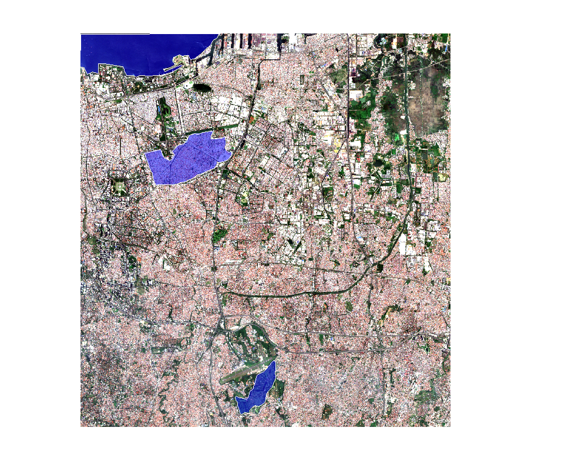
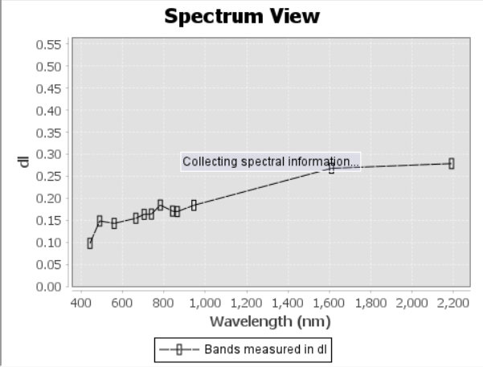
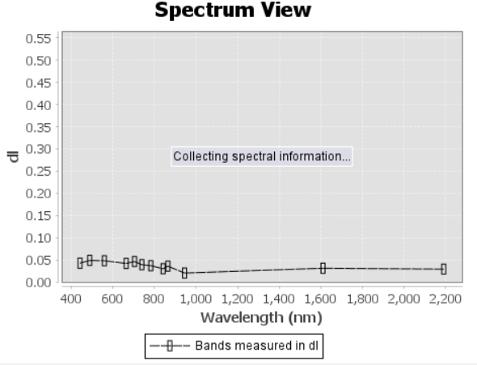
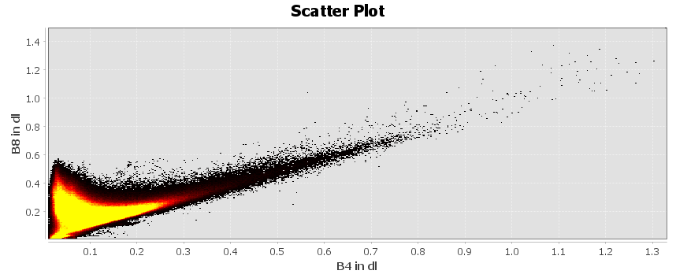

# Week 1 : Introduction to Remote Sensing

## Summary

In this practical, I used SNAP to analyze Sentinel-2 Level-2A imagery to understand the basic concepts of remote sensing, particularly regarding the spectral characteristics of various land cover types. The process involved visualizing RGB imagery, creating subsets of the study area, and sampling using polygons for water, vegetation, and urban areas.The analysis results showed that each land cover type has a distinct reflectance pattern at different electromagnetic wavelengths. These differences allow for the identification and classification of objects on the Earth's surface based on their spectral response. Therefore, I can conclude that spectral analysis is an essential foundation for various remote sensing applications, including land cover classification and environmental monitoring.

## Analysis

{width="70"}

### Spectral Signature

{width="70"}

{width="170"}

{width="170"}

Spectral signature analysis shows that each land cover type has a distinct reflectance pattern. Vegetation has low reflectance in the visible region due to absorption by chlorophyll, then increases sharply around 700–800 nm (red edge) and remains high in the NIR region before decreasing in the SWIR. In contrast, water exhibits very low and relatively flat reflectance values across wavelengths because it absorbs most of the electromagnetic energy. Urban areas have higher reflectance values than water, but they don't show a clear pattern, with a gradual increase with wavelength, reflecting the heterogeneous nature of surface materials like concrete and asphalt. Therefore, I can conclude that spectral interpretation is more reliable for natural objects like vegetation than for complex urban areas.

### Scatter Plot

{width="170"}

Meanwhile, the scatterplot between the red (B4) and NIR (B8) bands shows a fairly clear separation of classes, with vegetation having high values in the NIR and low in the red band, while water has low values in both bands. Urban areas are more widely spaced between the two, showing significant reflectance variation. However, the overlap between classes, particularly in urban areas, indicates the limited spatial resolution of Sentinel-2 (10 meters), which results in mixed pixels. Therefore, I believe that while spectral analysis is effective as an initial approach, its results are not fully accurate for detailed classification without additional methods such as machine learning-based classification or higher-resolution data.

## Limitations

There are several limitations to this analysis. First, Sentinel-2's spatial resolution (10 meters) results in mixed pixels, especially in complex urban areas. This makes it difficult to obtain truly homogeneous samples and can reduce the accuracy of spectral analysis. Second, polygon selection was done manually, potentially introducing subjective bias in determining representative areas. This can affect the consistency of results between users. Furthermore, although the data used is Level-2A (Bottom of Atmosphere), atmospheric factors and environmental conditions can still affect reflectance values. Therefore, I think the analysis results need to be interpreted with potential uncertainty in mind.

## Supporting Studies

Tempfli et al. (2009) explain the basic principles of the interaction of electromagnetic energy with objects on the Earth's surface. For example, vegetation has high NIR reflectance, while water absorbs almost all the energy, thus having low reflectance. Meanwhile, Jensen (2015) emphasizes the importance of digital image processing and numerical analysis in interpreting remote sensing data, including the use of scatterplots and spectral analysis for classification. In my opinion, Tempfli et al. (2009) focuses more on physical concepts and spectral theory, while Jensen (2015) emphasizes practical applications in digital data analysis. In this practical, the two approaches complement each other: Tempfli's theory explains spectral patterns, while Jensen's methods are used to analyze the data practically. Therefore, I can conclude that theoretical understanding and technical skills are equally important in interpreting remote sensing data.

## Future Application

The techniques used in this practical can be applied to future applications, such as urban growth monitoring, green space analysis, and water resource management. Furthermore, with the development of platforms like Google Earth Engine, remote sensing analysis can be performed more efficiently on a large scale. This approach could support my future career prospects as a consultant, as it can support data-driven decision-making in areas such as sustainable urban planning and environmental management.

## Reflection

At the beginning of the practical, using SNAP felt quite challenging, especially in understanding the functions of various tools such as spatial subsetting, polygon creation, and spectral analysis. However, as the process progressed, my understanding of remote sensing concepts became clearer, especially in connecting theory with visual results. For me, one of the most interesting things was seeing how spectral differences can be used to distinguish objects in real life. This improved my ability to interpret data more critically, not only based on visuals but also based on numerical reflectance values. However, difficulties also arose in identifying urban areas due to their heterogeneous nature. This provided an understanding that remote sensing analysis is not always simple and often requires a more complex approach. Overall, this week provided a deeper understanding that remote sensing relies not only on data, but also on interpretation, conceptual understanding, and strong analytical skills.

## Reference

Jensen, J.R. (2015) Introductory Digital Image Processing: A Remote Sensing Perspective. 4th edn. Upper Saddle River: Prentice Hall.

Tempfli, K., Huurneman, G., Bakker, W., Janssen, L., Feringa, W., Gieske, A., Grabmaier, K., Hecker, C., Horn, J. and Kerle, N. (2009) Principles of Remote Sensing: An Introductory Textbook. Enschede: ITC.
