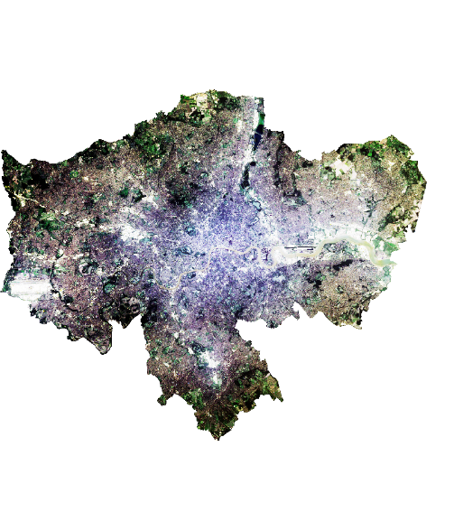
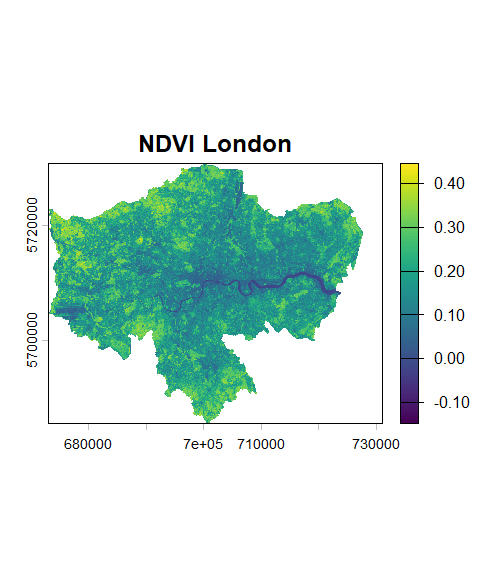

# Week 3: Corrections

## Summary

In this week's practical, I learned about multispectral satellite image processing using Landsat 8 and Landsat 9 Collection 2 Level 2 (surface reflectance) data. The process began with selecting two adjacent image tiles to cover the study area, namely London. Since a single tile was insufficient to cover the entire area, a mosaicking process was performed to combine the two images into a single continuous dataset. Next, the study area boundaries were determined using administrative data from GADM, specifically the Greater London area. The vector data was then adjusted to match the coordinate system of the raster image before cropping and masking. The final stage involved creating visualizations such as true color, false color, and enhancement, as well as calculating the NDVI (Normalized Difference Vegetation Index) to identify vegetation distribution in the study area.

## Analysis
{width="70%"}

The visualization results show a clear distinction between urban and vegetated areas in the Greater London area. In the true-color image, the city center appears predominantly light gray, representing built-up areas, while the suburbs show green, indicating vegetation. This is even more apparent in the false-color image, where vegetation appears as bright red and is more widespread in the suburbs than in the city center. The River Thames is also clearly visible as a dark linear feature that divides the study area.

{width="70%"}

NDVI results support this interpretation, with valuesranging from -0.1 to 0.4, with low valuesconcentrated in the city center and high values (\>0.3) in the suburbs. However, in my opinion, these NDVI results still have limitations in representing vegetation conditions in urban areas. Some areas within the city show moderate NDVI values, which are likely parks or green spaces, but could also be affected by mixed pixels of vegetation and buildings. Furthermore, Landsat's relatively coarse spatial resolution (30 m) can result in inaccurate detection of small details such as street vegetation or small parks. Therefore, although NDVI is quite effective in seeing general patterns, interpretation of the results still needs to be done carefully.

## Limitations

One of the main limitations of this practical is its reliance on image quality, particularly regarding cloud cover. The presence of clouds can interfere with interpretation and reduce the accuracy of the analysis. Furthermore, NDVI is a simple index and cannot capture the full complexity of urban environments. Mixed pixels in urban areas can lead to ambiguous NDVI values. Another limitation is Landsat's spatial resolution (30 meters), which is not detailed enough to capture small features such as trees on roads or small parks, which can lead to underestimation of vegetation.

## Supporting Studies

Jensen (2015) explains that mosaicking is necessary when a single image does not cover the entire study area, which aligns with the practical steps in combining two Landsat tiles for the London area. However, there are differences in the level of complexity of the data processing. In the literature, image processing often involves more in-depth atmospheric correction steps, such as Dark Object Subtraction (DOS) or radiative transfer models (Joyce, 2013; Jensen, 2015). Meanwhile, in this practical, Landsat Collection 2 Level 2 data, which already contains surface reflectance, was used, so the atmospheric correction process was not explicitly performed. This simplifies the workflow but also reduces understanding of the correction process itself.

In terms of vegetation analysis, the use of NDVI in this practical is consistent with the approach described by Schulte to Bühne & Pettorelli (2018), who stated that NDVI is effective for identifying vegetation distribution. However, the literature also emphasizes that NDVI has limitations, particularly in urban areas with mixed pixels. This is evident in the lab results, where some urban areas still show ambiguous NDVI values. Therefore, I believe that while this practical method aligns with the basic principles in the literature, the approach used tends to be simpler and more practical. This makes it easier to implement, but it also limits the depth of analysis compared to more complex methods used in academic studies.

## Future Application

The method used in this practical has various real-world applications, particularly in environmental monitoring and urban planning. NDVI can be used to monitor vegetation changes, identify green areas, and support urban sustainability policies. Furthermore, this method can be further developed by using higher-resolution imagery such as Sentinel-2, or by combining other techniques such as machine learning-based classification. For my career prospects as a consultant, this technique is very helpful for conducting time-series analysis, allowing me to monitor environmental changes over time, such as urban expansion or vegetation degradation.

## Reflection

This internship provided a deeper understanding of the remote sensing workflow, from raw data processing to analysis of the results. One important thing I learned was the importance of matching coordinate systems between raster and vector data. I also understood that although NDVI is a simple index, its results are quite effective in identifying vegetation patterns. However, interpretation of the results still requires critical consideration due to the method's limitations. Overall, this week enhanced my understanding of how satellite data can be used for spatial analysis, particularly in environmental and urban contexts.

## Reference

Jensen, J. R. (2015). Introductory Digital Image Processing: A Remote Sensing Perspective (4th ed.). Pearson Education. Joyce, K. (2013). Remote Sensing Lecture/Practical Materials.

Schulte to Bühne, H. & Pettorelli, N. (2018). Better together: Integrating and fusing multispectral and radar satellite imagery to inform biodiversity monitoring, ecological research and conservation science. Methods in Ecology and Evolution, 9(4), 849–865.
