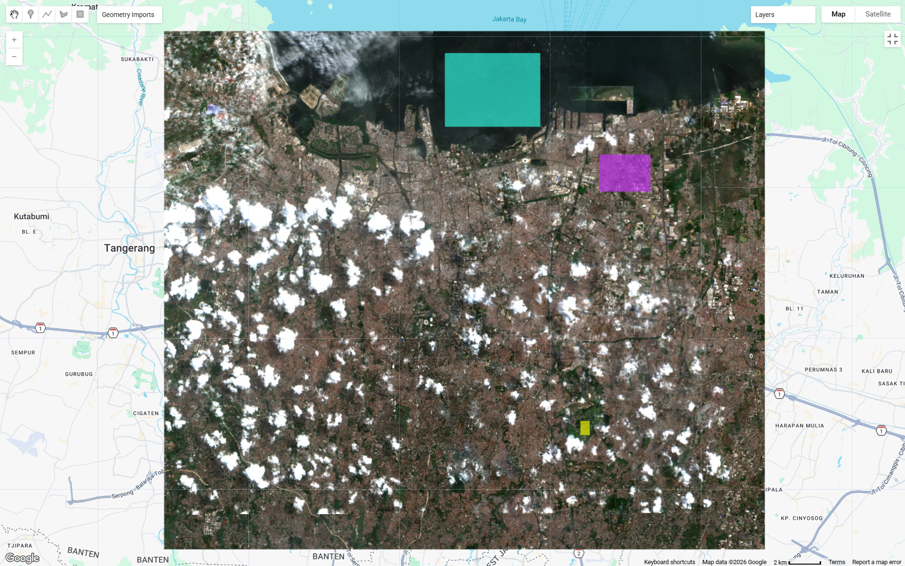
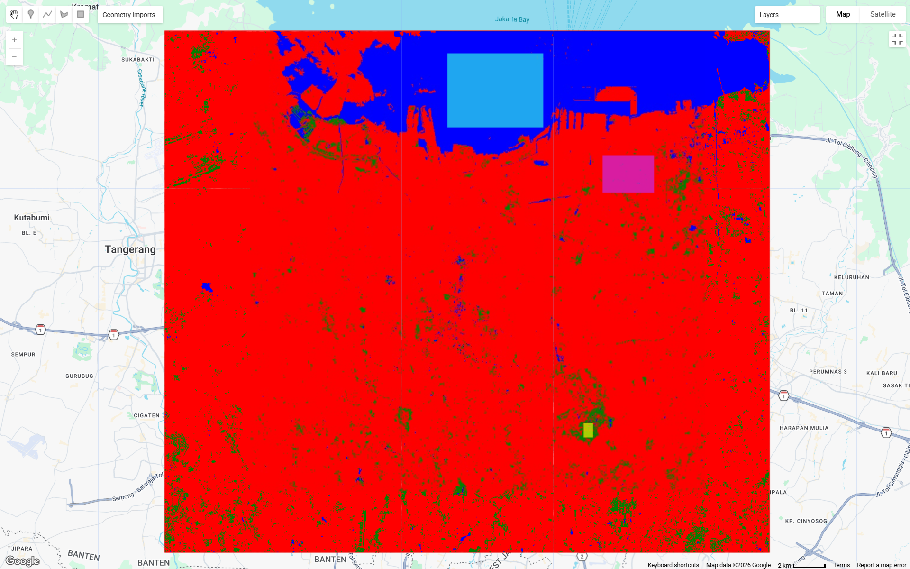

# Week 6: Classification I

## Summary

This week, the learning focused on supervised classification using remote sensing data with the help of the Random Forest algorithm in Google Earth Engine (GEE). The practical began with the selection of Sentinel-2 imagery, the application of cloud masking, and the creation of a median composite for the Jakarta area. Next, training data was manually created using small polygons for three land cover classes: urban, water, and vegetation. The training data was then used to train a classification model and produce a land cover map. The most interesting thing about this practical was how the quality of the training data greatly affects the classification results. I learned that it is not only the algorithm that determines the results, but also the size, location, and homogeneity of the training polygons. Small, clean polygons (not mixed with other classes and not covered by clouds) produce better classification than large or mixed polygons. In addition, preprocessing stages such as cloud masking are also very important, because residual clouds can cause classification errors.

## Analysis
{width="70%"}
{width="70%"}

Sentinel-2 image classification results for the Jakarta region show that the urban class (red) dominates almost the entire study area. This aligns with Jakarta's characteristics as a metropolitan area with high building density. Water areas (blue) are quite clearly identified in the northern part, particularly in the Jakarta Bay area, indicating that the training samples for the water class are quite representative. Meanwhile, the vegetation class (green) appears only in small numbers and is scattered, reflecting the limited green open space in urban areas. However, noise or misclassification is still visible, especially in areas covered by clouds or cloud shadows in the RGB image, which causes some pixels to be classified incorrectly.

In my opinion, these classification results still have significant limitations, primarily due to the unbalanced distribution of training samples and too few for certain classes, such as vegetation. This causes the model to tend towards the urban class, resulting in almost the entire area being classified as built-up. Furthermore, the presence of incompletely masked clouds also affects the accuracy of the results. To improve classification quality, more and more varied training samples should be used for each class and the sampling area should be free of clouds. This approach is in line with the concept of accuracy in remote sensing which emphasizes the importance of input data quality and sample distribution in producing more reliable classification.

## Limitations

There are several limitations to this practical. First, the presence of clouds remains a major issue, even after masking. Remaining clouds often have high reflectance values and can be misclassified as urban. Second, the amount and distribution of training data are still limited, so the model may not be able to represent all spectral variations in the study area. Furthermore, the classification I used only divides the data into three simple classes, which cannot adequately describe the complexity of urban areas. Sentinel-2 data with a resolution of 10 meters also has limitations in detecting small objects. This practical also does not include quantitative accuracy evaluations, such as confusion matrices, so the accuracy of the results cannot be definitively measured.

## Supporting Studies

Pal and Mather (2005) discussed the use of Support Vector Machines (SVM) in remote sensing classification and showed that SVMs often outperform traditional classification methods, especially on high-dimensional data and limited training sets. Compared to the Random Forest used in this experiment, SVMs are capable of forming optimal decision boundaries. However, SVMs require more complex parameter settings, while Random Forests are easier to use and more robust, especially on platforms like GEE. Meanwhile, Barsi et al. (2018) emphasized that accuracy in remote sensing is not just one dimension, but encompasses various aspects such as thematic, spatial, and temporal accuracy. This is particularly relevant to this experiment, because even if the classification results appear correct visually, there is still potential for error due to cloud cover, limited training data, and spatial resolution. Therefore, in my opinion, these two studies demonstrate that while Random Forest is a practical and easy-to-use method, the choice of classification method and accuracy evaluation remain crucial for producing more accurate and reliable analyses.

## Future Application

In my opinion, this practical method has many potential real-world applications, particularly in monitoring land-use change. For example, land cover classification can be used to monitor urban expansion, vegetation changes, and coastal dynamics. In a city like Jakarta, this information is crucial for urban planning, environmental management, and disaster risk mitigation. In the future, the analysis can be enhanced by using higher-resolution or multi-temporal data to examine changes over time. Furthermore, more advanced classification methods such as SVM or deep learning can be used to improve accuracy. Accuracy evaluation also needs to be added so that classification results can be used more validly in decision-making.

## Reflection

This practical provided an understanding of how machine learning can be applied in remote sensing. I found it fascinating that a simple process like selecting training polygons can have such a significant impact on the final results. This made me more aware that analysis depends not only on tools, but also on the decisions made by the user. However, I also recognize that the results obtained are not always perfect and need to be critiqued. Going forward, I'm interested in exploring more complex methods and understanding how to improve the accuracy of classification results.

## Reference

Barsi, Á., Kugler, Z., László, I., Szabó, G., Abdulmutalib, H., 2018. Accuracy dimensions in remote sensing. International Archives of the Photogrammetry, Remote Sensing & Spatial Information Sciences 42.

Pal, M., Mather, P.M., 2005. Support vector machines for classification in remote sensing. International Journal of Remote Sensing 26, 1007–1011.
