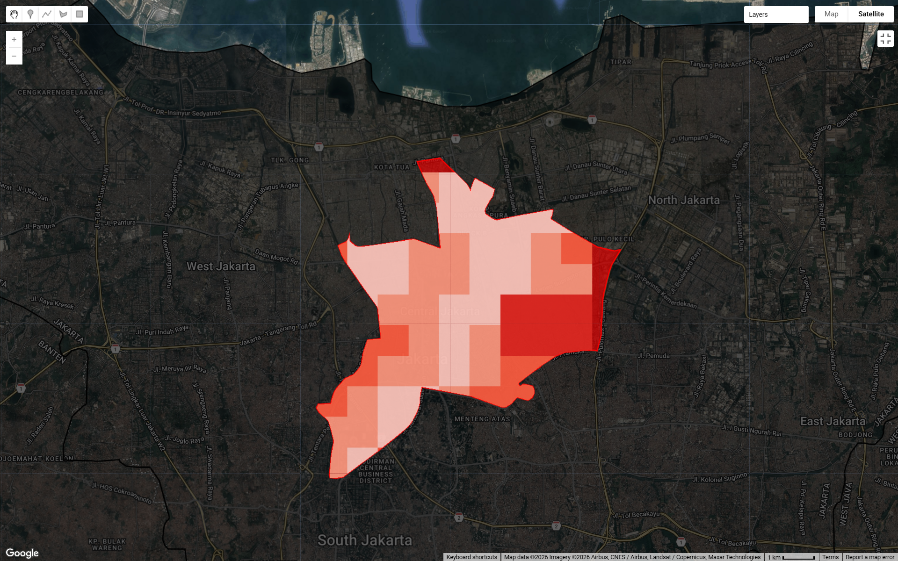
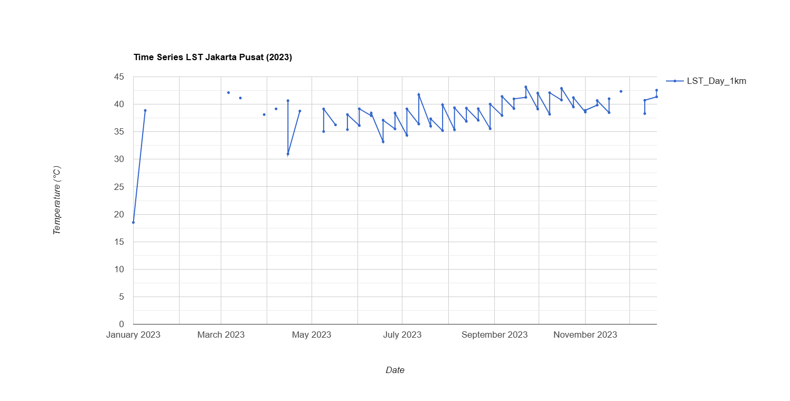

# Week 8-9: Temperature and SAR

## Week 8: Temperature

### Summary

This week, I learned how to use remote sensing data, specifically Landsat 8 imagery, to analyze Land Surface Temperature (LST) in urban areas. The practical involved several key steps: image acquisition, temperature conversion from Kelvin to Celsius, calculation of average surface temperature, and spatial analysis using a grid. The main outputs of this practical were average temperature maps and percentile-based heat index maps that classify temperatures into five categories.

What was particularly interesting was how satellite data can be used to identify temperature variations on a local scale, even within a small area like Central Jakarta. By using the percentile approach, I was able to see the relative distribution of temperatures, not just absolute values. This helped me identify areas with higher heat intensity contextually. However, I also realized that these results are highly dependent on the parameters used, such as the time period, cloud filtering, and spatial resolution of the data.

### Analysis

{width="600px"}

Based on Figure X, the heat index map shows quite clear spatial variations in surface temperature in Central Jakarta. Areas with the highest heat index values (dark red) are concentrated in the eastern and northern parts of the study area, while areas with lower values (lighter colors) are scattered in the central and western parts. This pattern indicates that temperature distribution is not uniform but is influenced by local environmental characteristics. Areas with higher temperatures are likely related to high building density, intense urban activity, and the dominance of impermeable surfaces such as asphalt and concrete, which absorb and store heat.

Conversely, areas with relatively lower temperatures likely have elements that help reduce temperatures, such as the presence of vegetation, open spaces, or urban structures that allow for better air circulation. However, because this analysis does not directly incorporate land cover data such as NDVI, this interpretation remains indicative. Nevertheless, the resulting pattern remains consistent with the concept of urban heat islands, where temperature variations are strongly influenced by differences in land use and development intensity within an urban area.

### Limitations

Although this method is quite effective, there are several limitations that should be considered. First, the relatively small number of Landsat images used due to cloud cover filters may not be fully stable, so the temperature representation may not be fully stable. Second, Landsat's spatial resolution (30 meters) may not be detailed enough to capture temperature variations at the microscale, especially in highly heterogeneous urban environments.Moreover, this analysis does not directly consider causal factors such as vegetation, building density, or human activity. Without additional data such as NDVI or land use, the interpretation remains inferential. This suggests that remote sensing temperature analysis should be combined with other datasets to generate a more comprehensive understanding.

### Supporting Studies

Wilson (2020) demonstrated that urban heat distribution is influenced not only by physical factors but also by social histories, such as redlining policies. The study found that areas historically discriminated against tend to have higher temperatures due to a lack of investment in green space and infrastructure. This provides perspective that temperature analysis is not only environmental but also related to social injustice. Comparing these practical results, I believe it's likely that areas with a high heat index in Central Jakarta also share similar characteristics in terms of density and lack of vegetation, despite their different social contexts. Meanwhile, Klinenberg (1999), in his study of heat waves in Chicago, demonstrated that the impact of high temperatures is significantly influenced by social factors such as social isolation and economic conditions. He emphasized that heat is not only a natural phenomenon but also a "social disaster." This broadens my understanding that temperature analysis using remote sensing should not stop at mapping but also consider its impact on society. Therefore, a technical approach like the one used in this practical can form the basis for a broader analysis that integrates social and policy aspects.

### Future Application

In the future, as a prospective consultant, I plan to expand this analysis by integrating additional data such as NDVI to measure vegetation, or land use data to identify the relationship between temperature and urban characteristics. Furthermore, this method can be applied to temporal analysis to observe temperature changes over time, particularly in the context of climate change. In a policy context, the results of such techniques can be used to identify priority areas in urban planning, such as increasing green space or mitigating urban heat islands. Integrating remote sensing data with urban planning policy holds great potential, although challenges such as data access, technical capacity, and inter-agency coordination remain obstacles.

### Reflection

This week provided a fascinating insight into how remote sensing technology can be used to analyze complex environmental phenomena in urban areas. I find this method highly relevant to current urban issues, particularly those related to climate change and urbanization. However, what I found most interesting was how this technical analysis can be linked to social aspects, as demonstrated in the studies by Wilson (2020) and Klinenberg (1999).

### Reference:

Klinenberg, E., 1999. Denaturalizing Disaster: A Social Autopsy of the 1995 Chicago Heat Wave. Theory and Society 28, 239–295.

Wilson, B., 2020. Urban Heat Management and the Legacy of Redlining. Journal of the American Planning Association 86, 443–457.

## Week 9: SAR

### Summary

This week, after completing Week 8, I tried the practical SAR presented by Olie. I learned how remote sensing data analysis approaches are not limited to a single image but can be expanded using image collections and statistical analysis to understand temporal dynamics. The material presented emphasized the importance of using multi-temporal data, such as MODIS, and the application of statistical methods such as mean, standard deviation, and t-tests to detect change.

In the practical, I expanded on the results of Week 8 (Central Jakarta heat index) by adding a time-based analysis. I used MODIS Terra and Aqua data to create a surface temperature (LST) time series throughout 2023. Furthermore, I calculated a mean temperature map to illustrate the distribution of average temperatures and a standard deviation map to identify temperature variations. The results showed that Central Jakarta has relatively high temperatures compared to its surrounding areas, with distinct temperature variations between areas. This approach demonstrated that simple statistical analysis can provide deeper insights than visualizing a single image alone.

### Analysis

{width="70%"} 

{width="70%"}

{width="70%"}

In my opinion, these results demonstrate that MODIS data is quite effective for observing general temperature patterns, but it is less capable of capturing detailed temperature variations at the city scale due to its coarse resolution (1 km). This makes temperature differences between small areas (for example, between green areas and densely built-up areas) less visible. Furthermore, while statistical analyses such as mean and standard deviation provide an initial overview, these methods are not sufficient to identify scientifically significant changes, as is done with the SAR approach using the t-test.

Going forward, I believe this analysis could be improved by incorporating higher-resolution data such as Landsat or even a multi-sensor approach. Furthermore, the use of more robust statistical methods or machine learning could provide deeper insights. This is especially important if this analysis is to be used for decision-making, such as urban planning or mitigating the impact of urban heat islands.

### Limitations

First, MODIS data has a relatively coarse spatial resolution (1 km), so small details within cities cannot be detected well. This is in contrast to Landsat, which has a higher resolution but lower temporal frequency. Second, this analysis only uses simple statistics such as the mean and standard deviation, so it does not explicitly test the significance of changes like the t-test method in SAR. This means that the detected changes are not necessarily statistically significant. Third, external factors such as atmospheric conditions, humidity, and cloud cover can also affect the temperature values measured by the sensor, so interpretation of the results must be done carefully.

### Supporting Studies

Canty (2020) developed a SAR-based change detection method using multi-temporal statistical analysis that is capable of identifying significant changes more robustly than simple methods. This approach utilizes the statistical distribution of backscatter values to detect continuous changes. Furthermore, a study by Zhuang et al. (2019) showed that methods such as log-ratio and ratio in SAR can be used to detect changes, but the results are highly dependent on the threshold used and often require additional validation using a ROC curve. This suggests that although SAR methods are more complex, they also face challenges in interpreting and validating the results. Compared to my practical work, the approach used is much simpler, using only the mean and standard deviation of LST data. However, this approach remains relevant because it follows the same principle: using multi-temporal data to understand change. The difference is that in SAR, changes are measured through backscatter and tested statistically (e.g., t-test), whereas in this practical work, changes are interpreted through temperature variations. Thus, this practice can be considered as a simplified version of the change detection approach, which can be further developed using more complex statistical methods such as in SAR studies.

### Future Application

In the future, this method can be developed by integrating higher-resolution data, such as combining Landsat and MODIS to achieve a balance between spatial and temporal resolution. Furthermore, the statistical approach can be enhanced by using methods like t-tests or machine learning to improve the accuracy of change detection. This analysis also has potential applications in urban planning, particularly in identifying areas with high temperatures that require interventions such as increasing green space. Furthermore, this approach can be used for local climate change monitoring or environmental policy evaluation in urban areas.

### Reflection

This week was very interesting because I began to understand that remote sensing is not just about creating maps, but also about analyzing data statistically and temporally. I feel that this approach is more realistic and applicable, especially in the context of urban studies and environmental change. I also realized that while simple methods like mean and standard deviation are quite informative, there are many more complex methods like the SAR t-test that can provide more accurate results. In the future, I am interested in learning more about these methods. Overall, this practical helped me understand how remote sensing data can be used for more in-depth analysis, and how simple approaches can form the basis for more complex methods in the future.

### Reference

Canty, M.J. (2020) Image analysis, classification and change detection in remote sensing: with algorithms for ENVI/IDL and Python. 3rd edn. Boca Raton: CRC Press.

Zhuang, H., Deng, K., Fan, H. and Yu, Y. (2019) ‘A comprehensive evaluation of change detection methods for SAR images’, Remote Sensing, 11(3), pp. 1–20.
